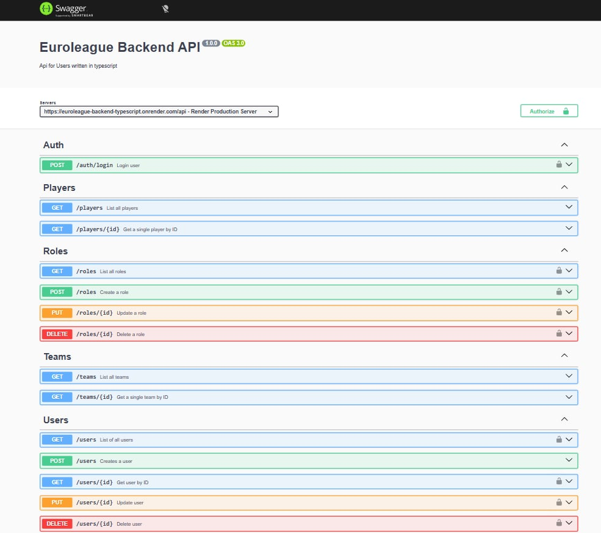

# 🏀 Euroleague Backend API

A **RESTful Backend API** built with **Node.js, Express, and TypeScript** for the Euroleague project.
It handles authentication, user management, and provides public basketball-related data such as **players** and **teams**.

This backend is designed to work seamlessly with the
👉 **Euroleague Frontend (React + TypeScript)** application.

---

## 📦 Features

* User **registration & login**
* **JWT-based authentication**
* Public endpoints for **Players** and **Teams**
* Protected routes for authenticated users
* RESTful API architecture
* API documentation with **Swagger (OpenAPI)**
* Clean and scalable project structure (routes, controllers, middlewares)

---

## 🚀 Technologies Used

* **Node.js**
* **Express**
* **TypeScript**
* **MongoDB & Mongoose**
* **JWT (JSON Web Tokens)**
* **Swagger (OpenAPI 3.0)**
* **dotenv**

---

## 📘 API Documentation (Swagger)

The API is fully documented using **Swagger (OpenAPI)**.

🔗 **Live Swagger Documentation:**
👉 [https://euroleague-backend-typescript.onrender.com/api/docs](https://euroleague-backend-typescript.onrender.com/api/docs)



Anyone can access this link to:

* View all available endpoints
* See request/response schemas
* Understand which routes are **public** and which require authentication

> ℹ️ The Swagger UI is configured in **read-only mode** (Try it out disabled) for clarity and security.

---

## 🌍 Public Endpoints

These endpoints are **open** and do not require authentication:

* `GET /players`
* `GET /players/:id`
* `GET /teams`
* `GET /teams/:id`
* `POST /users`

---

## 🔐 Protected Endpoints

Some endpoints require a valid **JWT token**, such as:

* User profile access
* User update operations

Authentication is handled via the `Authorization` header:

```
Authorization: Bearer <token>
```

---

## ⚙️ Environment Variables

Create a `.env` file in the root directory with the following variables:

```env
PORT=3000
MONGO_URI=your_mongodb_connection_string
JWT_SECRET=your_jwt_secret
```

---

## ▶️ Getting Started (Local Setup)

### 1. Clone the repository

```bash
git clone https://github.com/stratossal/euroleague-backend-typescript.git
cd euroleague-backend-typescript
```

### 2. Install dependencies

```bash
npm install
```

### 3. Run the server

```bash
npm run dev
```

The server will start at:

```
http://localhost:3000
```

Swagger will be available at:

```
http://localhost:3000/api/docs
```

---

## 🔗 Related Projects

* **Frontend Repository:**
  [https://github.com/stratossal/frontend_euroleague](https://github.com/stratossal/frontend_euroleague)

---

## 👨‍💻 Author

Developed as part of a **full-stack Euroleague project**, focusing on clean architecture, security, and clear API documentation.
